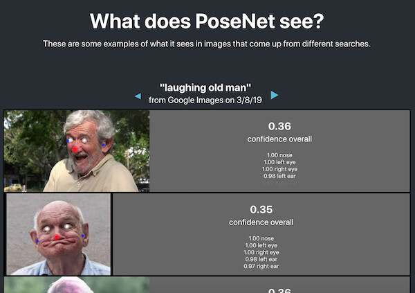
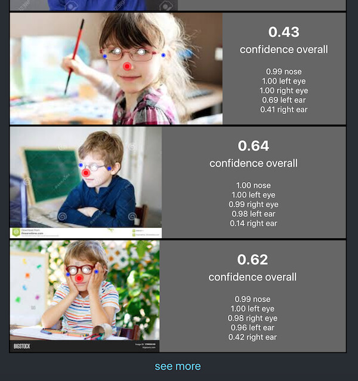
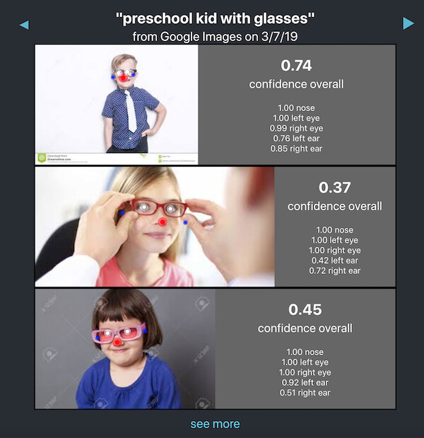
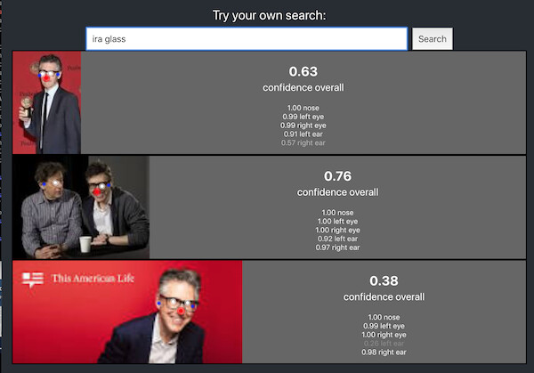
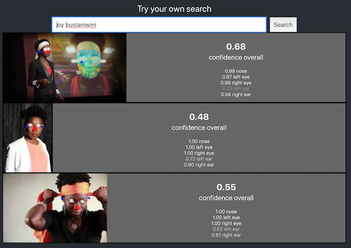
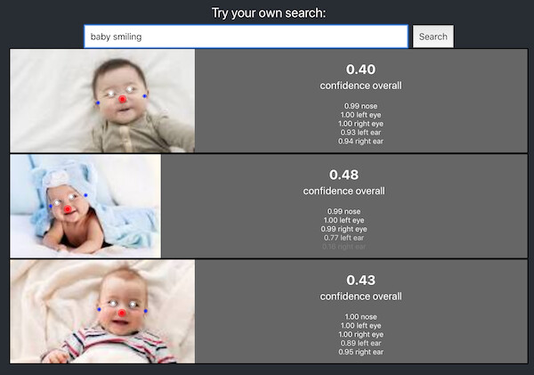
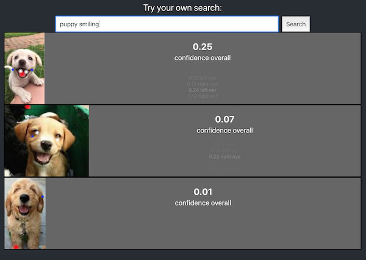
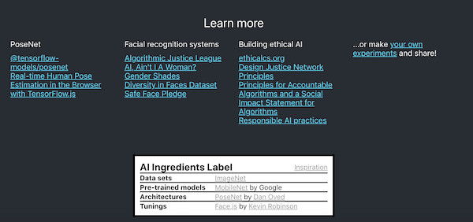
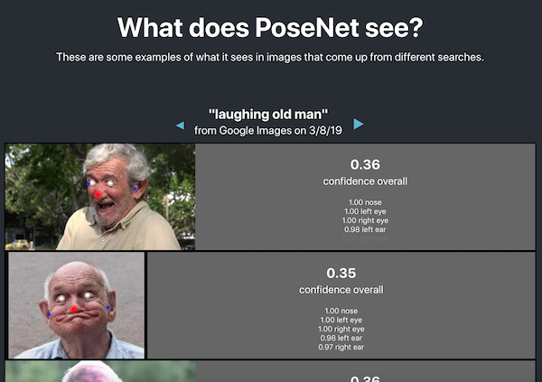
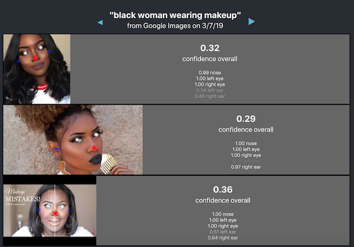

# posenet-subgroups
experimenting with posenet on images of different subgroups


## Demo
https://posenet-subgroups.herokuapp.com/

### Browse through


### Try your own


### Learn more








### New data sets
On Google Images, this grabs images from the console:
```
JSON.stringify({srcs: [].slice.call(document.querySelectorAll('.rg_ic')).map(el => el.src)})
```

### Development
`$ npm start`

Runs the app in the development mode.<br>
Open [http://localhost:3000](http://localhost:3000) to view it in the browser.

The page will reload if you make edits.<br>
You will also see any lint errors in the console.

This project was bootstrapped with [Create React App](https://github.com/facebook/create-react-app).